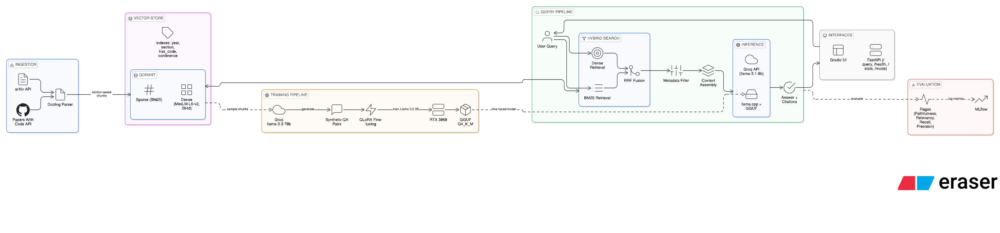

# DocRAG Intelligence Platform

> **Stage 1 Complete** — End-to-end RAG pipeline: document ingestion → hybrid search → fine-tuned LLM → dual inference modes

A production-grade Document Intelligence system built entirely on open-source tools and consumer hardware (RTX 3060 6GB). Ask natural language questions across a corpus of Computer Vision research papers and receive cited, grounded answers — either via Groq cloud API or a locally-served fine-tuned GGUF model.

---

## The Problem

Organizations — research teams, law firms, healthcare providers, financial institutions — are drowning in documents. Finding specific information across hundreds of PDFs is slow, inconsistent, and expensive. Existing solutions either require sending sensitive data to cloud APIs, or lack the semantic intelligence to understand domain-specific content.

**This project solves it with a pipeline that is:**
- **Semantic** — understands meaning, not just keywords
- **Private** — fully local inference mode, zero data leaves your machine
- **Grounded** — every answer cites its source chunks
- **Domain-adapted** — fine-tuned on your documents, not generic web text
- **Measurable** — Ragas evaluation harness quantifies answer quality

---

## Stage 1 Results

| Metric | Value |
|--------|-------|
| Papers collected | 76 (CVPR · ICCV · NeurIPS · arXiv) |
| Chunks indexed | 2,141 section-aware chunks |
| Hybrid search latency | **~5ms avg · 7ms p95** |
| RAG end-to-end latency (Groq) | **~1.1s total** |
| Base model | Llama 3.2 3B Instruct |
| Trainable parameters | 11.3M / 1.25B **(0.90%)** |
| Training hardware | RTX 3060 6GB VRAM |
| Ragas faithfulness | _run `evaluation/run_ragas.py` to populate_ |
| Ragas answer relevancy | _run `evaluation/run_ragas.py` to populate_ |

---

## Architecture

```
 arXiv API + Papers With Code
          │
          ▼
   ┌─────────────┐
   │   Docling   │  PDF → section-aware chunks
   │             │  (Abstract / Methods / Results / ...)
   └──────┬──────┘
          │
          ▼
   ┌─────────────────────────────────────────────┐
   │                  Qdrant                      │
   │  Dense  : all-MiniLM-L6-v2 (384d, cosine)   │
   │  Sparse : BM25 via FastEmbed                 │
   │  Index  : year · section · has_code · conf   │
   └──────┬──────────────────────────────────────┘
          │
          ├──► Groq llama-3.3-70b ──► 4,000 synthetic QA pairs
          │                                    │
          │                                    ▼
          │                          ┌──────────────────┐
          │                          │  Unsloth QLoRA   │
          │                          │  Llama 3.2 3B    │
          │                          │  RTX 3060 · ~4h  │
          │                          └────────┬─────────┘
          │                                   │
          │                                   ▼
          │                          GGUF Q4_K_M export
          │
   User Query ──► Hybrid Search (RRF) ──► Context Assembly
                                                │
                              ┌─────────────────┴──────────────────┐
                              │                                     │
                        Cloud mode                            Local mode
                     [ Groq API ]                          [ llama.cpp ]
                   llama-3.1-8b-instant               Fine-tuned GGUF Q4_K_M
                     ~1.1s · fast                      Fully offline · private
```

---

## Tech Stack

| Layer | Tool | Why This Tool |
|-------|------|---------------|
| **Document Parsing** | [Docling](https://github.com/DS4SD/docling) | Preserves section structure from academic PDFs — chunks map to Abstract / Methods / Results, not arbitrary 512-token windows |
| **Vector Store** | [Qdrant](https://qdrant.tech) | Only major vector DB that applies payload filters *during* vector search — critical for filtered hybrid search |
| **Hybrid Search** | Qdrant + FastEmbed BM25 | Dense (semantic) + sparse (keyword) with RRF fusion catches both meaning and exact CV terminology |
| **Synthetic Data** | [Groq](https://groq.com) | 500+ tok/s free tier — generates 4,000 QA pairs from document chunks without manual labeling |
| **Fine-tuning** | [Unsloth](https://github.com/unslothai/unsloth) | 2× faster + 60% less VRAM than standard HuggingFace — makes 3B fine-tuning feasible on 6GB VRAM |
| **Local Inference** | [llama.cpp](https://github.com/ggerganov/llama.cpp) | GGUF Q4_K_M — fully offline, zero marginal cost, HIPAA/GDPR compliant |
| **Cloud Inference** | [Groq](https://groq.com) | 500–800 tok/s API for fast cloud responses |
| **Experiment Tracking** | [MLflow](https://mlflow.org) | Fully local — no account, no rate limits, tracks loss curves + Ragas scores + model artifacts |
| **Data Versioning** | [DVC](https://dvc.org) | `dvc repro` reruns only changed pipeline stages — reproducible without re-running everything |
| **RAG Evaluation** | Ragas | Faithfulness · Answer Relevancy · Context Recall · Context Precision |
| **API Layer** | FastAPI | Clean REST API with live mode-switching between cloud and local inference |
| **Demo UI** | Gradio | Live PDF parsing demo + query interface + architecture docs |

---

## RAG Techniques

| Technique | Implementation | Why It Matters |
|-----------|---------------|----------------|
| **Hybrid Search** | Dense + BM25 with RRF fusion | Catches both semantic similarity and exact technical terms like "DETR", "ViT", "mAP@50" |
| **Section-aware chunking** | Docling section boundaries | Retrieves "Methods section of DETR paper" not an arbitrary mid-paragraph split |
| **Metadata filtering** | Qdrant payload indexes | Filter by year / conference / has_code *during* search at no extra latency cost |
| **Chunk overlap** | 2-sentence overlap | Preserves context at section boundaries |
| **Deterministic IDs** | UUID5 from chunk_id | Re-indexing is safe — same chunk never creates duplicate Qdrant points |
| **Domain fine-tuning** | Unsloth QLoRA on CV QA pairs | Generator understands CV terminology — base model answers generically, fine-tuned model answers specifically |
| **LLM-as-judge evaluation** | Groq 70b scores outputs | Faithfulness, relevancy, recall, precision — measurable and comparable across versions |

---

## Base Model vs Fine-tuned Model

| | Base Llama 3.2 3B | DocRAG Fine-tuned 3B |
|---|---|---|
| **Training data** | General web text | 4,000 CV/ML QA pairs from your documents |
| **CV terminology** | Generic understanding | Domain-adapted — knows mAP, IoU, FPN, DETR, ViT in context |
| **Answer style** | Verbose, unfocused | Concise, grounded, cites paper sections |
| **Hallucination risk** | Higher | Lower — trained to stay within retrieved context |
| **VRAM at inference** | ~2.5GB (Q4_K_M) | ~2.5GB (Q4_K_M) — identical |
| **Latency** | Same | Same |
| **Cost** | Zero (local) | Zero (local) |

Fine-tuning changes **behaviour**, not size. The model learns to respond the way a CV researcher would — citing sections, using correct terminology, declining to speculate beyond the retrieved context.

---

## Business Value

### Research Teams
- Literature review that takes days now takes minutes
- Ask "what loss functions does this paper use?" across 200 papers at once
- Filter by year, conference, or has-code to find reproducible work

### Enterprises (Legal · Healthcare · Finance)
- **Local inference** — zero data leaves your infrastructure
- HIPAA / GDPR / attorney-client privilege compliant by design
- Auditable answers with source citations for human review workflows

### Cost-Sensitive Deployments
- Fine-tuned 3B model costs ~$0 per query vs $0.01–0.06/1K tokens for GPT-4
- 95%+ cost reduction at enterprise query volume
- One-time training cost on consumer hardware

### ML Engineers
- Reference implementation of the full RAG + fine-tuning lifecycle
- Every design decision is documented with rationale
- Reproducible pipeline via DVC — `dvc repro` rebuilds from scratch

---

## Future Roadmap — Research Assistant Platform (Stage 2+)

Stage 1 builds the foundation. Here is where it goes next:

### Stage 2 — Multi-domain Knowledge Base
- Expand to any document corpus (legal, clinical, financial, internal docs)
- Support Word, PowerPoint, HTML via Docling's multi-format pipeline
- Incremental indexing — new documents trigger automatic re-embedding

### Stage 3 — Advanced Retrieval
- **Reranking** — cross-encoder to re-score top-k chunks
- **HyDE** — Hypothetical Document Embeddings for better query expansion
- **Parent-child chunking** — fine-grained retrieval, full-section context
- **Multi-hop reasoning** — questions requiring synthesis across multiple papers

### Stage 4 — Multi-modal Understanding
- Figure and chart extraction from PDFs
- Visual question answering over paper diagrams
- Table extraction and structured data queries

### Stage 5 — Production Platform
- Multi-tenant architecture with document-level access control
- Streaming responses
- Automated retraining when new documents are ingested
- HuggingFace Spaces public demo
- GitHub Actions CI — Ragas evaluation on every model update

### Long-term Vision
The fine-tuning pipeline here is the core of a **domain-adaptive research assistant** — a system that learns from an organization's own documents and improves as the corpus grows. The same pipeline that today answers questions about CV papers can tomorrow answer questions about internal engineering docs, legal precedents, or clinical research — with the same privacy guarantees and latency.

---

## Project Structure

```
doc-rag/
├── ingestion/
│   ├── collect.py              # arXiv + Papers With Code downloader
│   └── parse.py                # Docling PDF → section-aware chunks
├── vectorstore/
│   ├── setup_collection.py     # Qdrant collection + payload indexes
│   ├── index.py                # Embed + upsert (dense + sparse vectors)
│   └── search.py               # Hybrid search test + latency benchmark
├── training/
│   ├── generate_data.py        # Groq synthetic QA generation (ShareGPT)
│   └── finetune.py             # Unsloth QLoRA + MLflow + GGUF export
├── inference/
│   ├── serve.py                # FastAPI RAG server (Groq + llama.cpp)
│   └── test_query.py           # CLI tester + benchmark
├── evaluation/
│   └── run_ragas.py            # LLM-as-judge Ragas evaluation
├── ui/
│   └── app.py                  # Gradio demo UI
├── SETUP.md                    # Complete step-by-step guide
├── docker-compose.yml          # Qdrant container
├── dvc.yaml                    # Reproducible pipeline
├── requirements.txt
└── .env.example
```

---

## Quick Start

```bash
git clone https://github.com/YOUR_USERNAME/doc-rag.git
cd doc-rag
uv venv .venv --python 3.12 && source .venv/bin/activate
uv pip install -r requirements.txt
cp .env.example .env            # add GROQ_API_KEY
docker compose up -d
python verify_setup.py          # must show 14/14 ✅
```

See **[SETUP.md](SETUP.md)** for the complete step-by-step pipeline guide.

---

## Hardware

Tested on: **ASUS TUF · RTX 3060 6GB · 16GB RAM**

| Stage | VRAM | Time |
|-------|------|------|
| Indexing 2,141 chunks | ~1.5 GB | ~6 seconds |
| Fine-tuning 3 epochs | ~5.5 GB | ~4–5 hours |
| Local inference Q4_K_M | ~2.5 GB | ~2–5s per query |

Every constraint (QLoRA, seq_len=1024, batch=1, GGUF Q4_K_M) was made intentionally to fit 6GB VRAM. This is the point — meaningful ML engineering within real hardware limits.

---

## Design Decisions

**Why not LangChain / LlamaIndex?**
Building retrieval and the RAG pipeline from scratch demonstrates understanding of the mechanics, not just wrapper API calls. Every component is inspectable and replaceable.

**Why synthetic training data?**
Industry-standard — used by Microsoft (Phi series), Meta (Llama), Mistral. Groq generates grounded QA pairs from your own document chunks. No manual labeling required.

**Why Qdrant?**
The only major vector DB that applies payload filters *simultaneously* with vector search. For "Methods sections from 2023 papers with code" this is architecturally correct — not a post-filter workaround.

**Why dual inference modes?**
Enterprise customers cannot send documents to cloud APIs (HIPAA, GDPR, legal privilege). Local GGUF is not optional for regulated industries — it is the deployment model.

**Why MLflow over W&B?**
Zero external dependencies. Fully local. For a portfolio project, not requiring vendor accounts is a stronger reproducibility signal.

